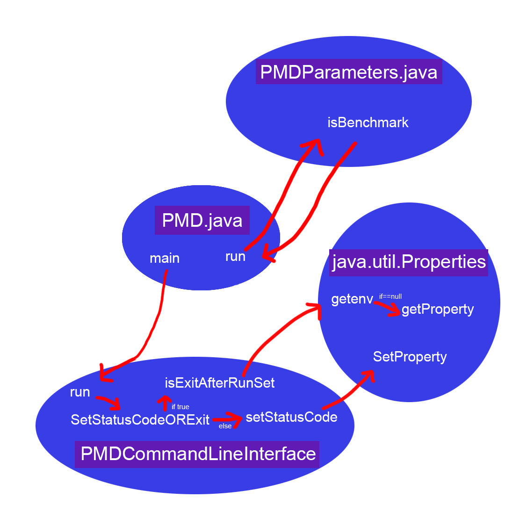

# Exercise 1

We chose the PMD.java class and in there the main file as a starting point to our analysis

In the pmd-core folder was no class with a run button so it made sense to take a look in 
PMD.java class since the program itself is called PMD. In there we found a comment above 
the main method that indicated that this was one of the starting points. We double checked 
for more main methods and found another one in the cpd folder. After a bit of research 
we found that cpd stands for copy-paste-detector. This must be another feature of the 
program but we decided to start from the PMD.java file because of the naming scheme and 
the documentation. 

Data Flow Analysis

1. Class: PMD.java
	Method: sortFiles
	
	The Method receives a final list of DataSources and a final PMDConfiguration 
	variable named configuration. 
	This variable gets tested in PMDConfigurations/isStressTest. 
	
	If the method returns true:
	it will randomize the order of files processing to minimize bugs and also shuffle
	the list.

	
	If the method isStessTest returns False:
	A boolean variable gets created and is true configuration uses short names.
	A second variable "inputPaths" gets filled with a comma separated list of 
	input paths to process source files.

	There is a second method inside this method.
	
	It receives two DataSources left and right. Creates new strings and uses the input 
	path and the short name to find "Nice". I guess the full name and filles the string
	with those. 

	It does that for left and right string. Then it compares the left with the right
	string and returns the result.

	

	
	
	

	

